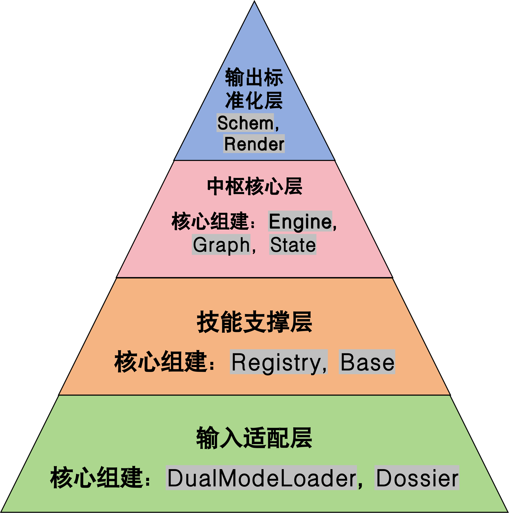
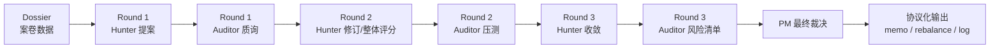

<div align="center">

# 第8练 Debate MAS 通用辩论决策引擎

> 一个基于 LangGraph 和 Skill 的辩论多智能体系统 (Multi-Agent System)。
> 以辩论式 ETF 投资决策为例，模拟多方专家（Hunter/Auditor/PM）进行量化投资决策辩论。

[](https://www.python.org/downloads/)
[](https://pypi.org/project/langgraph/)
[](./LICENSE)

<b>快速导航</b>：
<a href="#2-示范案例etf-投资决策系统">🧩 Demo Case</a> ·
<a href="#3-快速开始quickstart">🚀 Quickstart</a> ·
<a href="#4--三段式实战练习training-path">🏫 Training</a> ·
<a href="#-常见问题faq">❓ FAQ</a>

</div>

---

## 目录

- [目录](#目录)
  - [1. 介绍（Introduction）](#1-介绍introduction)
    - [1.1 项目定位](#11-项目定位)
    - [1.2 核心特点](#12-核心特点)
    - [1.3 通用核心架构](#13-通用核心架构)
    - [1.4 适用场景](#14-适用场景)
  - [2. 示范案例：ETF 投资决策系统](#2-示范案例etf-投资决策系统)
    - [2.1 案例背景](#21-案例背景)
    - [2.2 角色设定](#22-角色设定)
    - [2.3 决策流程](#23-决策流程)
    - [2.4 输出与可审计留痕](#24-输出与可审计留痕)
    - [2.5 项目文件结构（简化）](#25-项目文件结构简化)
  - [3. 快速开始（Quickstart）](#3-快速开始quickstart)
    - [3.1 环境要求](#31-环境要求)
    - [3.2 克隆示例系统](#32-克隆示例系统)
    - [3.3 安装依赖](#33-安装依赖)
    - [3.4 配置 .env 文件](#34-配置-env-文件)
    - [3.5 运行方式](#35-运行方式)
  - [4. 🏫 三段式实战练习（Training Path）](#4--三段式实战练习training-path)
  - [5. 📂 项目文件详细结构](#5--项目文件详细结构)
  - [6. ⚙️ 进阶配置详解 (Configuration)](#6-️-进阶配置详解-configuration)
    - [6.1 配置分层原则](#61-配置分层原则)
    - [6.2 核心参数速查表](#62-核心参数速查表)
  - [❓ 常见问题（FAQ）](#-常见问题faq)
  - [🤝 贡献指南](#-贡献指南)
  - [📄 许可证](#-许可证)
  - [🙏 致谢](#-致谢)
  - [📬 联系方式](#-联系方式)

---
## 1. 介绍（Introduction）

### 1.1 项目定位

**Debate MAS** 不是一个聊天机器人，它是一个 **“智能决策参谋团”** 。
- **提出观点**（进攻方）
- **质询与反驳**（审计/风控方）
- **平衡裁决与落地**（决策者）

在复杂的金融经济业务中，单体 LLM 往往存在“顺从用户”、“逻辑幻觉”或“缺乏实证”的痛点。本项目通过模拟人类 **投资决策委员会（Investment Committee）** 的博弈机制，将决策过程拆解为标准化的 **“感知 — 博弈 — 交付”** 闭环，引入 **“正方－反方－裁判”** 的三角循环架构，实现决策的自我审视与纠偏。

核心逻辑：
> **开放式输入 ➔ 角色化循环辩论 (LangGraph) + 技能实证 (Skills) ➔ 结构化协议输出**

### 1.2 核心特点

1. **降低确认偏误**  
   通过对抗式角色设计，强制生成反方论证与风险项，避免模型“迎合式回答”。

2. **实证约束**  
   借助 **Skill Registry**，Agent 的关键结论必须引用：  
   > * **Dossier** 中的数据/材料
   > * **Skill** 技能输出的计算结果
   从而大幅减少“无出处推理”和幻觉。

3. **结构化交付**  
   以协议（Protocol）定义最终交付格式（如候选标的、权重、理由、风险提示、证据来源），便于后续回测、审计、评估与自动化执行。

4. **全链路留痕与可复盘**  
   系统保留从“提案—质询—修订—裁决”的过程性产物：包含关键观点、证据引用与工具调用结果摘要等，便于复盘、对照与教学评阅（例如定位某条结论来自哪一份案卷证据或哪次技能输出）。

5. **模块化可扩展**  
   引擎、Dossier（证据容器）、Skill（工具能力）与 Protocol/Renderer（交付与落盘）解耦：  
   在不改动核心引擎的前提下，可新增/替换技能模块、输入适配器或输出格式，保持工程整洁并适配教学“分步练习/填空式扩展”。

### 1.3 通用核心架构

本系统采用四层金字塔架构设计，实现了模块的高度解耦与复用：

<div align="center">
  
</div>

* **Layer 1：输入适配层**
    > * **核心组件**：`DualModeLoader`, `Dossier`
    > * **对应目录**：`src/project_name/loader/`
    > * **功能**：解决多源异构数据的“上下文对齐”难题。无论是本地 CSV/PDF 文件，还是数据库流，均被归一化为标准的 **“案卷” (Dossier)**。Agent 只能基于案卷内容发言，确保信息边界清晰。

* **Layer 2：技能支撑层**
    > * **核心组件**：`Registry`, `Base`
    > * **对应目录**：`src/project_name/skills/`
    > * **功能**：Agent 的“手脚”与武器库。
       **基础类**：计算器、绘图、统计分析等。
       **业务类**：量化选股策略、风险侦探、估值模型等。
       支持**热插拔**：仅需编写简单的 Python 脚本即可注册新技能。

* **Layer 3：中枢核心层**
    > * **核心组件**：`Engine`, `Graph`, `State`
    > * **对应目录**：`src/project_name/core/`
    > * **功能**：系统的决策大脑。基于 **LangGraph** 构建动态对抗博弈图谱。它管理着“正方-反方-裁判”的**三角循环**，控制辩论轮次、熔断机制以及状态流转。

* **Layer 4：输出标准化层**
    > * **核心组件**：`Schema`, `Renderer`
    > * **对应目录**：`src/project_name/protocol/`
    > * **功能**：将复杂的辩论过程“降维”为可执行指令。严格定义 JSON 输出协议（Protocol），并负责将最终结果渲染为人类可读的备忘录和机器可读的指令单。

### 1.4 适用场景

* **💰 投资决策**：多因子选股辩论、宏观资产配置、行业轮动策略分析。
* **🛡️ 信贷风控**：贷前调查员（进）与风控官（退）的对抗博弈，生成授信建议。
* **⚖️ 合规审查**：业务创新方与法律合规官的制度边界辩论。
**……**

---

## 2. 示范案例：ETF 投资决策系统

### 2.1 案例背景

为了能够直观理解架构，我们提供了一个完整的参考实现：**ETF 智能投决会**。

模拟一个由**多位 AI 专家**组成的投资委员会，针对全市场 ETF ，基于**行情数据（结构化）**和**新闻（非结构化）**进行**多轮**辩论，最终产出调仓指令。

### 2.2 角色设定

| 角色 | 代号 | 类型 | 目标 | 核心技能 (Skills) |
| :--- | :--- | :--- | :--- | :--- |
| **Hunter** | 🐂 多头 | 进攻型 | 挖掘高收益机会，构建初选池 | `quantitative_sniper` (量化狙击手)<br>`theme_miner` (主题挖掘机) |
| **Auditor** | 🐻 空头 | 防守型 | 寻找逻辑漏洞，揭示潜在风险 | `market_sentry` (市场哨兵)<br>`forensic_detective` (审计侦探) |
| **PM** | ⚖️ 裁判 | 决策型 | 平衡收益风险，下达最终指令 | `portfolio_allocator` (组合配置家) |

### 2.3 决策流程

示例将一次完整的决策过程固定为 **最大3 轮（3 Rounds）**。

这不是简单的单向传递，而是一个 **“发散—清洗—收敛”** 的漏斗式循环。Hunter（多头）与 Auditor（空头）将进行三轮完整的交锋，最后由 PM（裁判）进行裁决。

#### 2.3.1 流程图


#### 2.3.2 流程详情

1.  **Round 1：海选与初筛**
    * **Hunter (提案)**：基于案卷数据，使用量化技能`quantitative_sniper`或主题挖掘`market_sentry`进行全市场扫描，根据策略筛选出 Top N 初选名单取并集。
    * **Auditor (质询)**：使用市场哨兵`market_sentry`或审计侦探`forensic_detective`对初选名单进行“硬伤检查”。

2.  **Round 2：重排与再审**
    * **Hunter (统一重排)**：对存活池中的标的调用量化技能的复合策略`Composite`，使用统一的标重新排序，确立核心优选名单。
    * **Auditor (压测)**：核心优选名单进行深度风控“深度审计”。如果工具调用失败或证据不足，会标记`NEED_EVIDENCE`

3.  **Round 3：收敛与终审**
    * **Hunter (收敛)**：针对 Auditor 的质疑进行最终修订。如果无法补齐证据，或剔除高分标的，或在“带病提拔”时注明风险。
    * **Auditor (风险清单)**：不再进行驳回，而是为“幸存者”打上最终的风险标签`Risk Tags`，形成《风险备忘录》。
    * **PM (裁判)**：阅读前三轮的博弈记录，调用`quantitative_sniper`，结合 Hunter 的得分与 Auditor 的风险报告，计算最终 Action (`BUY`/`WATCH`) 与 `Weight`。


### 2.4 输出与可审计留痕

Debate MAS 强调**过程透明**与**结果落地**。系统输出分为两个维度：**“终端实时交互”**（用于监控与调试）与**“文件化交付产物”**（用于决策与执行）。

#### 2.4.1 终端实时交互

通过 `core/config.py` 中的 `VERBOSE` 开关，您可以控制系统在运行时的可见度：

**模式 A：静默交付模式 (`VERBOSE = False`)**

适合批量回测或集成到上层 UI/API 时使用。仅输出启动信息和最终文件路径。

```text
📂 [Loader] 正在扫描文件夹: /BASE_DIR/data_test ...
   (启用表名映射 table_name_map: {'sampled_etf_basic': 'etf_basic', ...})
  -> 已加载表: etf_daily (*** rows, encoding=utf-8-sig)
  ......
✅ [Loader] 加载完成。

🟦 VERBOSE_MODE=summary：辩论级摘要（按轮/角色工具摘要 + 自然语言）

🟦 VERBOSE END

✅ 产物已生成：
- json: /BASE_DIR/output_reports/20260201_013850_审视当前 ETF 池给出下一周期调仓标的_log.json
- md: /BASE_DIR/output_reports/20260201_013850_审视当前 ETF 池给出下一周期调仓标的_memo.md
- csv: /BASE_DIR/output_reports/20260201_013850_审视当前 ETF 池给出下一周期调仓标的_rebalance.csv
- transcript: /BASE_DIR/output_reports/20260201_013850_transcript.json
```

**模式 B：透明作战室模式 (`VERBOSE = True`)**

默认开启，可以实时看到决策的演进过程：

* **🛠️ 工具调用链**：看到 Hunter 如何通过 `quantitative_sniper` 等skills召回候选标的，Auditor 如何通过 `forensic_detective` 等skills排雷。

* **🧠 Agent 思考**：看到多头与空头的观点博弈（ToolUse 决策、质疑细节）。

* **🌊 状态流转**：看到每一轮的 Diff（新增/剔除/分值变化）以及系统强制干预记录（如 `__rerank_cutoff__`）。

<details> 
  <summary><b>📺 点击展开完整终端日志示例</b></summary>

```text
📂 [Loader] 正在扫描文件夹: /BASE_DIR/data_test ...
  ......
✅ [Loader] 加载完成。

🟦 VERBOSE_MODE=summary：辩论级摘要（按轮/角色工具摘要 + 自然语言）

🛠️ Round 1 | Role=hunter | tool_calls+=3
  - quantitative_sniper(strategy='momentum') -> OK | produced=10 | 246ms
    insight: [全市场] momentum 产出 10 只，首选 159934 (100.0).
  - quantitative_sniper(strategy='sharpe') -> OK | produced=10 | 246ms
    insight: [全市场] sharpe 产出 10 只，首选 511360 (100.0).

[hunter]
ToolUse=YES 通过多策略召回扩大候选覆盖...
  ↳ [CANDIDATES] items=27 stop=CONTINUE

📝 Round 1 | Role=system | trace+=1
  · __diff__: 系统计算 DIFF patches=27

🛠️ Round 1 | Role=auditor | tool_calls+=1
  - market_sentry -> OK | produced=27 | 54ms
    insight: 审计完成: 27 只标的，27 只通过风控...

[auditor]
ToolUse=YES 对全部27只候选ETF执行流动性与波动率审计...
  ↳ [OBJECTIONS] items=1 stop=CONTINUE

... (Round 2、3 省略) ...

🛠️ Round 3 | Role=pm | tool_calls+=1
  - portfolio_allocator -> OK | produced=27 | 6ms
    insight: 决策完成: 买入 10 只, 观望 17 只, 否决 0 只。
  ↳ [DECISIONS] items=10 stop=STOP


🟦 VERBOSE END

✅ 产物已生成：
  ......
```
</details>

#### 2.4.2 交付四件套

系统运行结束后，会在 `output_reports/` 目录下生成标准化的交付文件，分别服务于**决策阅读**、**交易执行**、**合规审计**与**开发调试**。

1. **智能决策备忘录** (`*_memo.md`)
   * **用途**：人类可读的决策摘要。包含最终决议`Action`、Hunter 核心**逻辑支撑**、Auditor 的关键质疑及最终的**风险提示**清单。

<details> 
  <summary><b>📄 点击展开 memo.md 示例</b></summary>

```markdown
# 📝 智能决策备忘录 (AI Decision Memo)
**任务指令**: 审视当前 ETF 池，给出下一周期调仓标的、权重，并附理由与风险提示。
**生成时间**: 2026-02-01 01:38
**决策基准日(ref_date)**: 2025-10-26
**辩论轮次**: 3
**组合摘要**: BUY `10` 只 | 总仓位 `95.0%` | REJECT `0` 只

## 1. 核心决策表
|   代码 | 操作    |   权重(%) |   得分 | 决策理由                               | 风险备注   |
|-------:|:--------|----------:|-------:|:---------------------------------------|:-----------|
| 159783 | **BUY** |      10.5 |   99.3 | 夏普比率4.54，风险调整后收益良好       | 无显著风险 |
| 159217 | **BUY** |      10.5 |   99.1 | 乖离率-3.77%，具备技术性反弹基础       | 无显著风险 |
| 159780 | **BUY** |      10.5 |   98.6 | 夏普比率4.46，风险调整后收益不错       | 无显著风险 |
| 159782 | **BUY** |      10.5 |   98.4 | 夏普比率4.44，风险调整后收益较好       | 无显著风险 |
| 159305 | **BUY** |      10.5 |   98.1 | 夏普比率4.38，风险调整后收益尚可       | 无显著风险 |
| 588660 | **BUY** |      10.5 |   97.9 | 夏普比率4.35，风险调整后收益稳定       | 无显著风险 |
| 159934 | **BUY** |       9.5 |   78.3 | 动量与夏普双高分，综合优势显著         | 无显著风险 |
| 518600 | **BUY** |       7.6 |   65   | 动量、夏普、反转三因子均衡             | 无显著风险 |
| 511360 | **BUY** |       7.4 |   63.3 | 夏普最优（95.0分），动量极弱但反转尚可 | 无显著风险 |
| 159834 | **BUY** |       7.4 |   63.3 | 动量与夏普稳健，反转提供支撑           | 无显著风险 |

## 2. 逐标的决策说明
### 🟢 159783 (BUY)
- **综合得分**: 99.3
- **建议权重**: 10.50%
- **主要理由**:
  - 夏普比率4.54，风险调整后收益良好
  - 通过market_sentry与forensic_detective双重风控
- **⚠️ 风险警告**:
  - 无显著风险
---
### 🟢 159217 (BUY)
- **综合得分**: 99.13
- **建议权重**: 10.50%
- **主要理由**:
  - 乖离率-3.77%，具备技术性反弹基础
  - 通过market_sentry流动性与波动率审计
- **⚠️ 风险警告**:
  - 无显著风险
---
### 🟢 159780 (BUY)
- **综合得分**: 98.59
- **建议权重**: 10.50%
- **主要理由**:
  - 夏普比率4.46，风险调整后收益不错
  - 通过market_sentry与forensic_detective双重风控
- **⚠️ 风险警告**:
  - 无显著风险
---
### 🟢 159782 (BUY)
- **综合得分**: 98.36
- **建议权重**: 10.50%
- **主要理由**:
  - 夏普比率4.44，风险调整后收益较好
  - 通过market_sentry与forensic_detective双重风控
- **⚠️ 风险警告**:
  - 无显著风险
---
### 🟢 159305 (BUY)
- **综合得分**: 98.13
- **建议权重**: 10.50%
- **主要理由**:
  - 夏普比率4.38，风险调整后收益尚可
  - 通过market_sentry与forensic_detective双重风控
- **⚠️ 风险警告**:
  - 无显著风险
---
### 🟢 588660 (BUY)
- **综合得分**: 97.89
- **建议权重**: 10.50%
- **主要理由**:
  - 夏普比率4.35，风险调整后收益稳定
  - 通过market_sentry与forensic_detective双重风控
- **⚠️ 风险警告**:
  - 无显著风险
---
### 🟢 159934 (BUY)
- **综合得分**: 78.33
- **建议权重**: 9.49%
- **主要理由**:
  - 动量与夏普双高分，综合优势显著
  - 通过market_sentry与forensic_detective双重风控
- **⚠️ 风险警告**:
  - 无显著风险
---
### 🟢 518600 (BUY)
- **综合得分**: 65.0
- **建议权重**: 7.65%
- **主要理由**:
  - 动量、夏普、反转三因子均衡
  - 通过market_sentry与forensic_detective双重风控
- **⚠️ 风险警告**:
  - 无显著风险
---
### 🟢 511360 (BUY)
- **综合得分**: 63.33
- **建议权重**: 7.42%
- **主要理由**:
  - 夏普最优（95.0分），动量极弱但反转尚可
  - 通过market_sentry与forensic_detective双重风控
- **⚠️ 风险警告**:
  - 无显著风险
---
### 🟢 159834 (BUY)
- **综合得分**: 63.33
- **建议权重**: 7.42%
- **主要理由**:
  - 动量与夏普稳健，反转提供支撑
  - 通过market_sentry与forensic_detective双重风控
- **⚠️ 风险警告**:
  - 无显著风险
---
```
</details>

2. **调仓指令单** (`*_rebalance.csv`)
   * **用途**：机器可读的结构化表格。包含标准字段：`time`(运行时间), `date`(调仓时间), `code`(标的代码), `action` (BUY/WATCH/REJECT)[可选], `weight`, `reason`[可选]。可直接导入算法交易系统。

***_rebalance.csv 示例**：

| time                | date       | code   | action | weight | reason |
|---------------------|------------|--------|--------|--------|--------|
| 2026-01-29 16:17:45 | 2025-10-26 | 159934 | BUY    | 0.1163 | 复合得分80.2：动量100 + 夏普96 + 反转44，强势趋势与高风险调整收益兼备 |
| 2026-01-29 16:17:45 | 2025-10-26 | 518600 | BUY    | 0.1001 | 复合得分70.4：动量74 + 夏普89 + 反转48，稳健上涨且波动可控 |
| 2026-01-29 16:17:45 | 2025-10-26 | 159834 | BUY    | 0.0981 | 复合得分69.1：动量70 + 夏普85 + 反转52，多因子均衡表现 |
| 2026-01-29 16:17:45 | 2025-10-26 | 159652 | BUY    | 0.0960 | 复合得分67.9：动量96 + 夏普81，但反转26，趋势强劲 |
| 2026-01-29 16:17:45 | 2025-10-26 | 517400 | BUY    | 0.0919 | 复合得分65.4：反转85 + 动量63 + 夏普48，超跌反弹潜力显著 |
|   ...   |   ...   |   ...   |   ...   |   ...   |   ...   |

3. **全链路审计日志** (`*_transcript.json` & `*_log.json`)
   * **用途**：决策全过程的“黑匣子”数据。包含每一轮的原始对话、结构化产物、工具调用参数与返回结果、观点修正过程。用于事后回溯、归因分析或合规审计。

<details>
<summary><b>🔍 点击展开 transcript.json 示例</b></summary>

```json
{
  "timestamp": "2026-02-01T01:38:50",
  "mission": "审视当前 ETF 池，给出下一周期调仓标的、权重，并附理由与风险提示。",
  "ref_date": "2025-10-26",
  "rounds": 3,
  "stop_reason": null,
  "transcript": [
    {
      "role": "user",
      "content": "严格使用案卷证据与工具输出；输出遵守 system prompt 的格式要求。"
    },
    {
      "role": "assistant",
      "content": "",
      "tool_calls": [
        {
          "name": "quantitative_sniper",
          "args": {
            "strategy": "momentum",
            "window": 20,
            "top_k": 10
          },
          "id": "call_301d3356c2b64876bedd5dad",
          "type": "tool_call"
        },
        {
          "name": "quantitative_sniper",
          "args": {
            "strategy": "sharpe",
            "window": 20,
            "top_k": 10
          },
          "id": "call_2efb53e5429c40648b8f09cb",
          "type": "tool_call"
        },
        {
          "name": "quantitative_sniper",
          "args": {
            "strategy": "reversal",
            "window": 20,
            "top_k": 10
          },
          "id": "call_d4f0aec01e024edeb328b895",
          "type": "tool_call"
        }
      ]
    },
       ...
    {
      "role": "assistant",
      "content": "",
      "tool_calls": [
        {
          "name": "market_sentry",
          "args": {
            "symbols": [
              "159934",
              "159652",
              "561330",
              "560860",
              "516650",
              "512400",
              "159876",
              "518600",
              "159834",
              "159558",
              "511360",
              "159816",
              "511880",
              "159783",
              "588390",
              "159796",
              "159780",
              "159782",
              "159305",
              "588660",
              "563500",
              "517400",
              "159321",
              "159322",
              "159217",
              "513780",
              "159615"
            ],
            "window": 20,
            "min_amount": 2000,
            "vol_threshold": 0.02
          },
          "id": "call_4aee2e6ecc81481a96308fed",
          "type": "tool_call"
        }
      ]
    },
       ...
}
```    
</details>

### 2.5 项目文件结构（简化）

```text
debate_mas/
├── data_test/                              # 本地案卷数据源
├── output_reports/                         # 系统产出目录
│
├── src/
│   └── debate_mas/
│       ├── main.py                         # CLI 主程序，解析参数并启动 Engine
│       │
│       ├── core/                           #【核心中枢】负责 Agent 编排与状态流转
│       │   ├── blend_rank.py               # 候选融合逻辑
│       │   ├── config.py                   # 全局配置
│       │   ├── engine.py                   # 引擎入口 
│       │   ├── graph.py                    # LangGraph 图定义
│       │   ├── personas.py                 # 人设定义
│       │   ├── state.py                    # 状态管理
│       │   └── tools.py                    # 工具守卫
│       │
│       ├── loader/                         #【数据基座】负责数据读取与标准化
│       │   ├── dossier.py                  # 统一案卷定义
│       │   ├── dual_mode_loader.py         # 双模加载器
│       │   └── sql_templates.py            # SQL 模板库
│       │
│       ├── protocol/                       # 【协议层】定义数据契约与 I/O
│       │   ├── etf_dabate.py               # NLP 解析器
│       │   ├── renderer.py                 # 渲染器
│       │   └── schema.py                   # Pydantic 模型
│       │
│       └── skills/                         #【技能层】具体的业务能力插件
│           ├── base.py                     # 技能基类
│           ├── registry.py                 # 注册中心
│           └── inventory/                  # 技能仓库
│               ├── forensic_detective/     # [技能] 风险审计
│               ├── market_sentry/          # [技能] 市场哨兵
│               ├── portfolio_allocator/    # [技能] 组合配置
│               ├── quantitative_sniper/    # [技能] 量化狙击
│               └── theme_miner/            # [技能] 主题挖掘
│
├── .env                                    # 环境变量配置
├── pyproject.toml                          # 项目依赖管理
└── README.md                               # 本文件
```

---

## 3. 快速开始（Quickstart）

### 3.1 环境要求

* **OS**: Linux / macOS / Windows
* **Python**: >= 3.10
* **Package Manager**: 推荐使用 [uv](https://docs.astral.sh/uv/) (极速管理)，也完全支持标准的 `pip`。

### 3.2 克隆示例系统

本项目托管于内部 Gitea 仓库，请使用 Git 命令将代码克隆至本地并进入项目目录：

```bash
# 1. 克隆仓库
git clone http://10.13.66.5:20091/Cufel-Practice/8-debate-mas.git

# 2. 进入项目目录 (关键步骤！)
cd 8-debate-mas
```

### 3.3 安装依赖

```bash
# 方式 A: 使用 uv (推荐，自动创建虚拟环境)
uv sync

# 方式 B: 使用 pip (标准方式)
# 建议先创建虚拟环境: python -m venv .venv && source .venv/bin/activate
pip install -r requirements.txt
```

### 3.4 配置 .env 文件

项目根目录需要一个 `.env` 文件来存储**敏感**凭证，填入以下关键信息：

```bash
# =========================================================
# 1. LLM 接入 (OpenAI 兼容接口)
# =========================================================
DASHSCOPE_API_KEY="sk-your-api-key-here"
DASHSCOPE_BASE_URL="https://dashscope.aliyuncs.com/compatible-mode/v1"

# =========================================================
# 2. 数据源接入 (可选，若使用本地 CSV 模式可留空)
# =========================================================
CLICKHOUSE_HOST=""
CLICKHOUSE_PORT=""
CLICKHOUSE_USER=""
CLICKHOUSE_PASSWORD=""
CLICKHOUSE_DB=""
```

### 3.5 运行方式

本项目支持模块方式运行（推荐），支持通过命令行参数灵活控制任务指令、数据源、回测日期与输出目录。

> **💡 运行提示**：
> 以下命令均以标准 `python` 为例。
> * 如果您已激活虚拟环境（`.venv`），直接运行即可。
> * 如果您使用 `uv` 且未激活环境，请在命令前加上 `uv run`（例如：`uv run python -m debate_mas ...`）。

具体参数名称以 `src/debate_mas/main.py` 为准；如需查看完整参数列表，请运行 `--help`。

#### 3.5.1 默认演示 

使用内置的测试数据和默认指令，跑通全流程：

```bash
python -m debate_mas
# 或者使用 uv (推荐):
# uv run python -m debate_mas
```

#### 3.5.2 查看帮助 

查看所有可用的命令行参数说明：

```bash
python -m debate_mas --help
```

#### 3.5.3 自定义任务 

指定特定的投资主题或板块（覆盖默认 Mission）：

```bash
python -m debate_mas \
  --mission "分析当前半导体行业ETF的投资机会，重点关注国产替代逻辑"
```

#### 3.5.4 指定数据源与日期

指定包含 CSV/PDF 的文件夹路径，适合教学与离线回测（防未来函数）：

```bash
python -m debate_mas \
  --folder "./data_test" \
  --date "2025-10-26"
```

> **注**：
> * **“`--folder`用于指定本地案卷目录”**
> * **“`--date`用于指定本次决策的基准交易日”**

#### 3.5.5 指定输出目录

自定义结果生成位置（默认为 `./output_reports`）：

```bash
python -m debate_mas \
  --output_dir "./my_custom_reports"
```

## 4. 🏫 三段式实战练习（Training Path）

本项目的练习采用 **Build → Transfer（搭建 → 迁移）** 的训练方式：  
先以 **ETF 投资决策** 为背景搭出最小可用的 Debate MAS，再把同一套框架迁移到其他业务（如贷款审批 / 合规审查）。

📌 **训练文档（必读）**：请前往 👉 **[TRAINING_PATH.md](./TRAINING_PATH.md)**

你将在训练中完成：

- **阶段一：Run & Sense**（黑盒跑通）  
  学会运行、观察、对比产物与证据链，理解入口与输出。

- **阶段二：Build the Core**（写出最小闭环引擎）  
  用 TODO 填空的方式实现：State / Graph / Engine / Loader / Protocol / Renderer 的最小契约。

- **阶段三：Skills & Connect**（插件能力）  
  自己写一个 Skill（最小可用），并接入到 Debate MAS 让角色可调用。

✅ **验收方式**：每个 Checkpoint 都配有 1 条运行命令 + PASS 条件，便于自测。

---

## 5. 📂 项目文件详细结构

```bash
debate_mas/
├── .pytest_cache/                          # Pytest 测试缓存目录
├── .venv/                                  # Python 虚拟环境目录
├── data_test/                              # 本地案卷数据源 (CSV/Excel/PDF/Txt 等)
├── output_reports/                         # 系统运行输出目录 (报告、JSON转录、日志)
│
├── src/
│   └── debate_mas/
│       ├── __init__.py                      # 包初始化文件
│       ├── __main__.py                      # 模块执行入口 (python -m debate_mas)
│       ├── main.py                          # 入口,被 __main__ 调用
│       │
│       ├── core/                            #【核心大脑】debate_mas系统的调度与逻辑控制中心
│       │   ├── blend_rank.py                # 候选融合算法 (加权融合、去重、保留最优)
│       │   ├── config.py                    # 全局配置中心 (模型参数、阈值、开关、路径)
│       │   ├── engine.py                    # 编排引擎 (初始化 State/Dossier，驱动 Graph 运行)
│       │   ├── graph.py                     # LangGraph 图定义 (Hunter/Auditor/PM 节点与流转控制)
│       │   ├── personas.py                  # 角色人设定义 (Prompts、规则、工具策略)
│       │   ├── state.py                     # 状态管理 (DebateState 定义、历史记录、收敛指纹)
│       │   └── tools.py                     # 工具构建与守卫 (ToolGuard、白名单校验、参数清洗)
│       │
│       ├── loader/                          #【数据基座】负责数据的读取与标准化
│       │   ├── __init__.py                  # Loader 模块初始化
│       │   ├── dossier.py                   # 统一案卷定义
│       │   ├── dual_mode_loader.py          # 加载器 (目前支持 Local Folder 和 ClickHouse 数据库)
│       │   └── sql_templates.py             # SQL 模版库 (用于 DB 模式下的动态查询生成)
│       │
│       ├── protocol/                        #【通信协议】定义输入输出格式与解析
│       │   ├── __init__.py                  # Protocol 模块初始化
│       │   ├── etf_dabate.py                # 文本解析 (从 LLM 回复中提取 JSON）
│       │   ├── renderer.py                  # 渲染器 (生成 .json, memo.md, .csv)
│       │   └── schema.py                    # 数据模型 (Pydantic 定义）
│       │
│       └── skills/                          #【技能层】插件化能力系统
│           ├── __init__.py                  # Skills 模块初始化
│           ├── base.py                      # 技能基类 (BaseSkill, BaseFinanceSkill, SkillContext)
│           ├── registry.py                  # 注册中心 (动态扫描 inventory 目录加载技能)
│           └── inventory/                   # 具体技能清单
│               ├── __init__.py              # Inventory 初始化
│               │
│               ├── forensic_detective/      # [技能] 风险侦探 (审计/排雷)
│               │   ├── __init__.py          # 包标识
│               │   ├── SKILL.md             # 定义技能角色、参数Schema、Prompt
│               │   ├── references/          # skill说明文档
│               │   │   └── README.md        # 技能使用/拓展说明
│               │   ├── scripts/             # 执行逻辑
│               │   └── templates/           # 输出模板
│               │       └── output.md        # 结果 Markdown 结构示例
│               │
│               ├── market_sentry/           # [技能] 市场哨兵 (监控/预警)
│               │   ├── ...                  # (结构同上)
│               │
│               ├── portfolio_allocator/     # [技能] 组合配置 (权重计算)
│               │   ├── ...                  # (结构同上)
│               │
│               ├── quantitative_sniper/     # [技能] 量化狙击手 (筛选/排序)
│               │   ├── __init__.py          # 包标识
│               │   ├── SKILL.md             # 定义技能角色、参数Schema、Prompt
│               │   ├── references/          # skill说明文档
│               │   │   ├── data_contract.md # 数据依赖契约
│               │   │   ├── metrics.md       # 数学公式定义
│               │   │   └── README.md        # 技能使用/拓展说明
│               │   ├── scripts/             # 执行逻辑
│               │   │   ├── __init__.py
│               │   │   ├── dataloader.py
│               │   │   ├── algo.py
│               │   │   └── handler.py       # 实现的具体量化计算逻辑
│               │   └── templates/           # 输出模板
│               │       ├── output.json      # 结构化输出模板
│               │       └── output.md        # 文本摘要模板
│               │
│               └── theme_miner/             # [技能] 主题挖掘 (非结构化分析)
│                   ├── ...                  # (结构同上)
│
├── tests/                                   # 测试目录
│   └── .gitkeep                             
│
├── .env                                     # 环境变量 (API Key, DB等,需自行配置)
├── .gitignore                               # Git 忽略规则
├── .python-version                          # Python 版本指定
├── pyproject.toml                           # 项目配置与依赖管理 (Hatch/Poetry/UV)
├── uv.lock                                  # 依赖锁定文件
└── README.md                                # 项目说明文档（本文件）
```

---

## 6. ⚙️ 进阶配置详解 (Configuration)

本项目遵循 **“敏感信息进 .env，业务逻辑进 config.py”** 的原则。
若需调整辩论烈度或风控标准，请修改 `src/debate_mas/core/config.py`。

### 6.1 配置分层原则

配置中心按功能分为两层：
* **A. 通用框架层 (Framework)**：控制“辩论怎么跑”（轮数、收敛、工具治理、日志）。**换业务场景时通常不需要大改。**
* **B. ETF场景特化层 (Domain)**：控制“ETF 怎么做”（候选生成、风控阈值、组合构建）。**换业务场景时必须重写。**

换句话说：**A 改的是系统行为（框架层），B 改的是业务结果（ETF层）。**

**非参数部分代码**

> 你可以把它理解成两类：  
> **必须：保证配置中心能写、能读、能带默认值**；  
> **拓展：为了写得更严谨、更可维护、更易校验**。

| import | 必须/可选 | 说明 |
|---|---:|---|
| `from __future__ import annotations` | ✅ 建议保留 | 类型注解更顺（尤其是 forward reference / dataclass 配合时） |
| `import os` | ✅ 必须 | 路径拼接 & 计算 `BASE_DIR / DATA_DIR` |
| `from dataclasses import dataclass, field` | ✅ 必须 | 用 dataclass 做配置对象，`default_factory` 写默认字典/列表 |
| `from typing import Dict, List, Any` | ✅ 必须 | 配置字段类型声明（便于 IDE / 静态检查 / 教学） |
| `Optional / Literal / Tuple` | ➕ 拓展 | 你想把“模式枚举 / 可空字段 / 返回结构”写得更严谨时再用 |
| `pathlib.Path` | ➕ 可替换/增强 | 更现代的路径写法（可替换 os.path） |
| `pydantic` | ➕ 拓展 | 需要更强校验/环境变量配置/自动报错时引入 |

> **【注意】**  
> 你在读/改这份配置时，先记住它的“结构外壳”是不变的：  
> 整个文件是用 `@dataclass(frozen=True) class SystemConfig:` 把参数集中起来，最后用 `CONFIG = SystemConfig()` 实例化成全局配置对象。

<details>
<summary><strong>👀 点击查看 config.py 非参数部分代码<</strong></summary>

```py
from __future__ import annotations

import os
from dataclasses import dataclass, field
from typing import Dict, List, Any

# ======================= 简单工具 =======================
def _default_base_dir() -> str:
    """把 BASE_DIR 默认值计算抽成函数"""
    return os.path.dirname(
        os.path.dirname(os.path.dirname(os.path.dirname(os.path.abspath(__file__))))
    )

@dataclass(frozen=True)
class SystemConfig:

#A、B、调试快照部分

CONFIG = SystemConfig()

```

</details>

### 6.2 核心参数速查表

#### A. 通用 DebateMas（框架层）

> 这里的参数决定：系统跑几轮、什么时候停、每轮能用多少工具、每个角色输出多长、日志打印多详细。  
> **它们不依赖 ETF**，只是“辩论框架”的运行规则。

| 参数 | 默认值 | 说明 | 修改结果 |
|---|---:|---|---|
| `MAX_ROUNDS` | `3` | 最多辩论几轮，超了就硬停 | `stop_reason=MAX_ROUNDS_DEBATE` |
| `EXIT_ON_CONSENSUS` | `True` | 三方都认可（STOP）就提前结束 | `stop_reason=CONSENSUS_STOP` |
| `VERBOSE` | `True` | 是否输出增量摘要 | `🟦 VERBOSE_MODE=summary` 详细内容出现/消失 |
| `ROLE_TEMPERATURE` | `0.9/0.3/0.1` | 角色风格：hunter更发散，pm更谨慎 | 文字风格变化明显 |
| `MAX_TOKENS_DEFAULT` | `3000` | 全局默认输出预算（不写就用它） | 输出整体变长/变短 |
| `ROLE_MAX_TOKENS` | 全 `3000` | 分角色单独设置预算 | 某个角色输出明显更长/更短 |
| `ROLE_TOOL_MAX_CALLS` | `4/2/1` | 每轮最多允许调用多少次工具 | `tool_calls` 上限受限 |
| `FORBID_SAME_TOOL_SAME_ARGS_IN_SAME_ROUND` | `True` | 同一轮里，同工具同参数只允许一次（防刷工具） | guard 触发/工具不再执行/重复调用被挡住 |
| `ENFORCE_TOOL_ON_NEED_EVIDENCE` | `True` | 如果出现 NEED_EVIDENCE，会强制下一轮补证据 | 你会看到“强制调用工具补证据”的 trace |
| `BASE_DIR / DATA_DIR` | 自动计算 | 项目根路径 & 默认数据路径定位 | 路径定位稳定，不依赖 cwd |

<details>
<summary><strong>展开：A 通用参数在 config.py 中对应的代码</strong></summary>

```py
# ============================================================
# A) 通用框架参数（Framework-Level）
# ============================================================
# --- 模型与温度（LLM backend：通用） ---
HUNTER_MODEL: str = "qwen3-max"
PM_MODEL: str = "qwen3-max"
AUDITOR_MODEL: str = "qwen3-max"

ROLE_TEMPERATURE: Dict[str, float] = field(default_factory=lambda: {
    "hunter": 0.9,   # 发散找机会（通用：提案/探索角色）
    "auditor": 0.3,  # 更稳（通用：审计/质疑角色）
    "pm": 0.1,       # 严谨决策（通用：裁决/定稿角色）
})

# --- Token 预算（通用） ---
MAX_TOKENS_DEFAULT: int = 3000  # 全局默认 max_tokens
ROLE_MAX_TOKENS: Dict[str, int] = field(default_factory=lambda: {
    "hunter": 3000,
    "auditor": 3000,
    "pm": 3000,
})

# --- 运行与证据策略（通用） ---
VERBOSE: bool = True  # 是否打印“增量摘要”
ENFORCE_TOOL_ON_NEED_EVIDENCE: bool = True  # 若出现 NEED_EVIDENCE，下一轮强制补证据（通用机制）

# --- 辩论流程控制（通用：收敛与终止） ---
MAX_ROUNDS: int = 3            # 最多辩论几轮（硬停）
EXIT_ON_CONSENSUS: bool = True # 双方都 STOP 则提前结束

# --- Tool Calling 框架硬约束（通用：工具治理） ---
ROLE_TOOL_MAX_CALLS: Dict[str, int] = field(default_factory=lambda: {
    "hunter": 4,
    "auditor": 2,
    "pm": 1,
})
FORBID_SAME_TOOL_SAME_ARGS_IN_SAME_ROUND: bool = True  # 同轮同参去重/防刷

# --- 候选数量硬约束（机制通用，但在本项目用于“候选池”） ---
ENFORCE_MIN_CANDIDATES: bool = True
HUNTER_MIN_CANDIDATES: int = 10

# --- 路径配置（通用：项目路径/默认数据目录） ---
BASE_DIR: str = field(default_factory=_default_base_dir)
DATA_DIR: str = field(init=False)

def __post_init__(self):
    object.__setattr__(self, "DATA_DIR", os.path.join(self.BASE_DIR, "data_test"))
```

</details>

#### B. ETF 场景特化（业务层）

> 这里的参数决定：  
>  - **hunter** 怎么召回候选
>  - **auditor** 怎么做风控审计
>  - **pm** 怎么做组合构建与配仓 
> 一旦你换业务（比如合同审计 / 论文评审 / 产品方案选择），这些字段要么不需要，要么**语义要重写**。

| 参数 | 默认值 | 你改它会发生什么 | 你通常会在日志里看到什么 |
|---|---:|---|---|
| `ROLE_TOOL_ALLOWLIST` | ETF 工具白名单 | 角色能用哪些 ETF 工具（技能本身是业务绑定） | 越权时会被 guard 拦住（如 `GUARD_DENIED`） |
| `HUNTER_DETERMINISTIC_PIPELINE` | `True` | 是否使用“教学可控”的候选生成流程 | system prompt / trace 会出现 Two-Stage 提示 |
| `HUNTER_PIPELINE_MODE` | `"two_stage"` | 两段式候选生成：recall → rerank | stage 切换清晰可见 |
| `HUNTER_RECALL_STRATEGIES` | 三策略 | recall 会跑哪些召回策略 | tool trace 会出现多策略调用 |
| `HUNTER_RECALL_MIN_STRATEGIES` | `2` | 至少跑几种策略才算“多样性达标” | 可能触发 `PIPELINE_RECALL_DIVERSITY_NOT_MET` |
| `HUNTER_RECALL_TOPK_PER_STRATEGY` | `10` | 每个策略召回 topk 多少 | 候选池大小变化明显 |
| `HUNTER_RERANK_STRATEGY` | `composite` | rerank 用什么统一标尺 | rerank 会出现 `composite` 调用 |
| `HUNTER_RERANK_OUTPUT_TOPN` | `20` | rerank 后截断 TopN（控 token） | 你会看到 `__rerank_cutoff__` 类 trace |
| `HUNTER_PIPELINE_SNIPER_STRATEGY` | `momentum` | pipeline 的默认主策略锚点 | 教学对比更稳定 |
| `HUNTER_BLEND` | `0.3/0.7` | 多来源候选融合权重（theme vs sniper） | merge 结果/顺序会变化 |
| `RISK_SCORE_THRESHOLD` | `50.0` | 风控阈值：高于就剔除 | `survivor_universe` 变小 |
| `SNIPER_DEFAULTS/PROFILES` | 一组窗口/阈值 | 因子窗口、PSR 等影响打分 | score/reason 变化明显 |
| `THEME_MINER_DEFAULTS` | `top_k/days/...` | 主题召回的默认参数 | 候选主题覆盖面变化 |
| `AUDITOR_*_ENFORCE` | 波动/费用/天数等 | 风险工具硬约束更严/更松 | objections / risk_reports 更严格/更宽松 |
| `PM_PORTFOLIO_ALLOCATOR_ENFORCE` | 组合规则 | 买入阈值、仓位上限、目标敞口等 | BUY 数量、weight 上限变化 |

<details>
<summary><strong>展开：B ETF 业务参数在 config.py 中对应的代码</strong></summary>

```py
# ============================================================
# B) ETF 业务参数（ETF Domain-Level）
# ============================================================
# --- 角色工具白名单（ETF技能名本身是业务绑定的；机制在 A4） ---
ROLE_TOOL_ALLOWLIST: Dict[str, List[str]] = field(default_factory=lambda: {
    "hunter": [
        "theme_miner",
        "quantitative_sniper",
    ],
    "auditor": [
        "market_sentry",
        "forensic_detective",
    ],
    "pm": [
        "portfolio_allocator",
    ],
})

# --- Hunter 两阶段 pipeline（ETF候选生成逻辑：recall → rerank） ---
HUNTER_DETERMINISTIC_PIPELINE: bool = True
HUNTER_PIPELINE_MODE: str = "two_stage"  # 可扩展：未来加 "free" / "ablation"

# Round0: 多策略召回
HUNTER_RECALL_STRATEGIES: List[str] = field(default_factory=lambda: ["momentum", "sharpe", "reversal"])
HUNTER_RECALL_MIN_STRATEGIES: int = 2
HUNTER_RECALL_TOPK_PER_STRATEGY: int = 10

# Round1+: 统一标尺 rerank
HUNTER_RERANK_STRATEGY: str = "composite"
HUNTER_RERANK_OUTPUT_TOPN: int = 20

# pipeline 中“默认主策略”（用于教学/日志固定锚点）
HUNTER_PIPELINE_SNIPER_STRATEGY: str = "momentum"

# --- 候选融合（ETF：多来源候选合并权重） ---
HUNTER_BLEND: Dict[str, float] = field(default_factory=lambda: {
    "theme_miner": 0.3,
    "quantitative_sniper": 0.7,
})

# --- 业务阈值（ETF：风控/剔除阈值） ---
RISK_SCORE_THRESHOLD: float = 50.0

# --- sniper / theme_miner 默认参数（ETF：因子与主题召回配置） ---
SNIPER_DEFAULTS: Dict[str, Any] = field(default_factory=lambda: {
    "window": 20,
    "top_k": 10,
    "min_amount": 1000.0,
    "threshold_mode": "none",
    "psr_confidence": 0.95,
})

SNIPER_PROFILES: Dict[str, Dict[str, Any]] = field(default_factory=lambda: {
    "momentum": {
        "window": 20,
        "threshold_mode": "none",
        "psr_confidence": 0.95,
    },
    "sharpe": {
        "window": 60,
        "threshold_mode": "psr",
        "psr_confidence": 0.95,
    },
    "reversal": {
        "window": 10,
        "threshold_mode": "none",
    },
    "composite": {},
})

SNIPER_ENFORCE: Dict[str, Any] = field(default_factory=lambda: {
    "min_amount": 1000.0,
})

SNIPER_LIMITS: Dict[str, Any] = field(default_factory=lambda: {
    "max_top_k": 200,
})

THEME_MINER_DEFAULTS: Dict[str, Any] = field(default_factory=lambda: {
    "top_k": 10,
    "days": 30,
    "top_industries": 3,
})

# --- Auditor 参数（ETF：风险审计工具约束） ---
AUDITOR_MARKET_SENTRY_ENFORCE: Dict[str, Any] = field(default_factory=lambda: {
    "window": 20,
    "min_amount": 1000.0,
    "vol_threshold": 0.03,
})

AUDITOR_FORENSIC_DETECTIVE_ENFORCE: Dict[str, Any] = field(default_factory=lambda: {
    "lookback": 60,
    "max_fee": 0.5,
    "min_days": 60,
})

# --- PM 参数（ETF：组合构建与买入规则） ---
PM_PORTFOLIO_ALLOCATOR_ENFORCE: Dict[str, Any] = field(default_factory=lambda: {
    "method": "linear_voting",
    "sizing_method": "kelly",
    "risk_penalty": 1.0,
    "max_position": 0.4,
    "buy_threshold": 60.0,
    "target_exposure": 0.95,
    "max_buys": 10,
})
```
</details>

<details>
<summary><strong>展开：调试快照 get_model_config()（你会在日志/渲染里看到的结构）</strong></summary>

```py
def get_model_config(self) -> Dict[str, Any]:
    return {
        "Hunter": self.HUNTER_MODEL,
        "Auditor": self.AUDITOR_MODEL,
        "PM": self.PM_MODEL,
        "Data_Dir": self.DATA_DIR,
        "Blend": self.HUNTER_BLEND,
        "Max_Tokens": {
            "default": self.MAX_TOKENS_DEFAULT,
            "by_role": self.ROLE_MAX_TOKENS,
        },
        "Min_Candidates": {
            "enabled": self.ENFORCE_MIN_CANDIDATES,
            "min": self.HUNTER_MIN_CANDIDATES,
        },
        "Sniper": {
            "defaults": self.SNIPER_DEFAULTS,
            "profiles": self.SNIPER_PROFILES,
            "enforce": self.SNIPER_ENFORCE,
            "limits": self.SNIPER_LIMITS,
            "pipeline": {
                "mode": self.HUNTER_PIPELINE_MODE,
                "recall_strategies": self.HUNTER_RECALL_STRATEGIES,
                "recall_min_strategies": self.HUNTER_RECALL_MIN_STRATEGIES,
                "recall_topk_per_strategy": self.HUNTER_RECALL_TOPK_PER_STRATEGY,
                "rerank_strategy": self.HUNTER_RERANK_STRATEGY,
                "rerank_output_topn": self.HUNTER_RERANK_OUTPUT_TOPN,
            },
        },
        "Auditor_Enforce": {
            "market_sentry": self.AUDITOR_MARKET_SENTRY_ENFORCE,
            "forensic_detective": self.AUDITOR_FORENSIC_DETECTIVE_ENFORCE,
        },
        "PM_Enforce": {
            "portfolio_allocator": self.PM_PORTFOLIO_ALLOCATOR_ENFORCE,
        },
        "Max_Rounds": self.MAX_ROUNDS,
        "Tool_Allowlist": self.ROLE_TOOL_ALLOWLIST,
        "Tool_MaxCalls": self.ROLE_TOOL_MAX_CALLS,
        "Dedup_SameToolSameArgs": self.FORBID_SAME_TOOL_SAME_ARGS_IN_SAME_ROUND,
        "Risk_Threshold": self.RISK_SCORE_THRESHOLD,
        "Hunter_Pipeline": {
            "enabled": self.HUNTER_DETERMINISTIC_PIPELINE,
            "sniper_strategy": self.HUNTER_PIPELINE_SNIPER_STRATEGY,
        },
    }
```

</details>


## ❓ 常见问题（FAQ）

### Q1: 运行时报 “API_KEY / BASE_URL 缺失” 或 LLM 不出字？

**现象**：程序启动但马上 fail，或每个角色都报鉴权失败/请求失败。  
**排查**：

- `.env` 是否在项目根目录（由 `CONFIG.BASE_DIR` 定位）
- 是否至少包含：
  - `..._API_KEY`
  - `..._BASE_URL`

**建议**：在 `main.py` 开头加一个“强校验”函数（你们可能已经有 `_require_env()`）确保缺了就直接报清楚。

### Q2: 报 “案卷中找不到 'etf_daily' 数据” / 数据为空？

**现象**：`quantitative_sniper`、`market_sentry` 等技能直接返回 fail。  
**原因**：`ctx.dossier.get_table("etf_daily")` 为空或表名不匹配。  
**排查方向**：

- 你的 dossier 构建是否把表注册成了 `"etf_daily"`（大小写、下划线一致）
- CSV/数据库读入后是否列名对齐（至少 `code/date/close`）
- `ref_date` 过滤后变空（常见：日期字段格式不对，或 `ref_date` 超出数据范围）

<details>
<summary><strong>展开：tests/快速自检（可直接复制）</strong></summary>

```py

from __future__ import annotations

import os
import sys
from pathlib import Path

import pandas as pd


def _import_project() -> None:
    """
    让 tests 直接运行时也能 import src/debate_mas
    用法：在项目根目录执行：python -m tests.test_dossier_etf_daily_smoke
    """
    root = Path(__file__).resolve().parents[1]
    src = root / "src"
    if str(src) not in sys.path:
        sys.path.insert(0, str(src))


def test_dossier_has_etf_daily() -> None:
    _import_project()

    # 下面这些 import 假设你们项目里有这些模块：
    # - CONFIG (提供 BASE_DIR / DATA_DIR 等)
    # - Dossier 构建函数（名字可能不同，你按你们真实名字改一行即可）
    from debate_mas.core.config import CONFIG

    # ✅ 你们项目里通常会有“读取案卷/构建 dossier”的函数
    # 你只需要把这一行换成你们实际的函数即可。
    from debate_mas.core.dossier import load_dossier  # <- 若模块名不同，改这里

    # 1) 用默认数据目录构建案卷（也可以改成你自己的 folder_path）
    folder_path = getattr(CONFIG, "DATA_DIR", None) or os.path.join(CONFIG.BASE_DIR, "data_test")
    dossier = load_dossier(folder_path=folder_path)

    # 2) 取表
    df = dossier.get_table("etf_daily")

    # 3) 断言 + 输出（失败会直接报错）
    assert df is not None, "dossier.get_table('etf_daily') 返回 None：请检查表名/加载逻辑/数据路径"
    assert not df.empty, "etf_daily 为空：请检查数据源是否加载成功、或 ref_date 过滤是否过严"

    # 4) 打印关键信息（排错用）
    print("✅ etf_daily loaded:", df.shape)
    print("columns:", list(df.columns))

    # 5) 最低字段检查（只查存在性，不做严格类型校验）
    required = {"code", "date", "close"}
    missing = required - set(map(str, df.columns))
    assert not missing, f"etf_daily 缺少必要列: {missing} (至少需要 code/date/close)"

    # 6) 看一眼 date 列（很多问题出在 date 格式）
    if "date" in df.columns:
        head = df["date"].head(5)
        print("date head:", head.to_list())


if __name__ == "__main__":
    # 允许直接 python 运行：python -m tests.test_dossier_etf_daily_smoke
    test_dossier_has_etf_daily()

```
</details>

### Q3: 我新增/修改了一个 Skill，但系统就是“找不到技能”或不被调用？

**现象**：LLM 提到要用某技能，但 tools 里没有；或 registry 没加载到。  
**你们架构下常见原因**：

- `skills/registry.py` 动态扫描的路径不包含你新建的目录
- `inventory/<skill_name>/__init__.py` 缺失导致包无法 import
- `scripts/handler.py` 类名/入口不符合 registry 预期（比如必须叫 `SkillHandler`）
- `SKILL.md` 的 `name:` 与目录名/注册名不一致（如果你们用它做索引）

**最小检查点**（按你们约定写死也行）：

- `inventory/<skill>/scripts/handler.py` 内存在 `class SkillHandler(BaseFinanceSkill):`
- `inventory/<skill>/SKILL.md` 的 `name:` 与 skill 名一致
- registry 能 import 到这个包（没有 ImportError）


### Q4: 明明写了工具，但运行时提示 `GUARD_DENIED` / 工具调用被拦住？

**现象**：日志里出现 `GUARD_DENIED`、`ROLE_TOOL_MAX_CALLS` 达到上限、同参去重触发。  
**原因**：你们的 `core/tools.py` 有工具治理：白名单 + 次数限制 + 同参去重。  
**排查顺序**：

1) 这个角色是否在 `ROLE_TOOL_ALLOWLIST` 里被允许使用该工具？  
2) 是否超过 `ROLE_TOOL_MAX_CALLS[role]`？  
3) 是否触发 `FORBID_SAME_TOOL_SAME_ARGS_IN_SAME_ROUND`（同一轮同参重复）？

**典型修复**：把技能名加入 allowlist（或调大 max calls），比如：

```py

ROLE_TOOL_ALLOWLIST = {
    "hunter": ["theme_miner", "quantitative_sniper", "your_new_skill"],
    "auditor": ["market_sentry", "forensic_detective"],
    "pm": ["portfolio_allocator"],
}

```

### Q5: 输出文件在哪？memo.md / rebalance.csv / log.json 没生成怎么办？

**现象**：终端跑完了，但找不到产物。  
**排查**：

- 是否传了 `--output_dir`？不传就看默认（你写的是 `${BASE_DIR}/output_reports`）
- 是否程序提前 fail（很多时候中途 fail 会导致 renderer 不执行）
- 权限问题：`output_dir` 没有写权限（尤其服务器环境）

**建议**：在 renderer 前后打印绝对路径，并确保目录存在：

```py

import os
os.makedirs(output_dir, exist_ok=True)
print("Output Dir =", os.path.abspath(output_dir))

```

### Q6: 想“新增一个因子/策略”到 quantitative_sniper，应该改哪？

**最推荐（也最适合教学）的路径**：

- `handler.py` 只负责：参数解析 / 调用 `algo` / 统一包装 `SkillResult`
- `algo.py` 只负责：数学计算（返回 `df_score`：`symbol/score/reason/extra`）
- `dataloader.py` 只负责：读表 + 清洗 + universe 过滤 + 防未来（`ref_date`）

**新增一个策略最小步骤**：

1) 在 `algo.py` 的函数`def user_defined_strategy(df: pd.DataFrame, params: Dict[str, Any]) -> pd.DataFrame`写新的策略或新增函数 `scan_newfactor(df, params) -> df_score`
2) 在 `run_strategy()` 里加一个分支  
3) 在 `SKILL.md` 里把 `strategy` 的枚举补上（说明 + 参数）

示例（只示意 run_strategy 的新增分支）：

```py

def run_strategy(df, params):
    s = params["strategy"]
    if s == "momentum": return scan_momentum(df, params)
    if s == "sharpe": return select_by_sharpe(df, params)
    if s == "reversal": return scan_reversal(df, params)
    if s == "composite": return scan_composite(df, params)
    if s == "new_factor": return scan_newfactor(df, params)  # 新增
    if s == "user_defined": return user_defined_strategy(df, params)
    raise ValueError(f"unknown strategy: {s}")

```

---

## 🤝 贡献指南

本项目面向教学与团队协作，欢迎通过以下方式参与改进：

- 提交 Issue：报告 bug / 提出改进建议 / 讨论新技能与新场景
- 提交 PR：修复问题、补充文档、增加测试用例、扩展 Skills/Protocols

建议提交前先确保：
- `python -m debate_mas --help` 可正常运行
- 关键路径（Loader / Engine / Skills / Renderer）不破坏既有产物格式（memo / csv / json）

## 📄 许可证

MIT License

## 🙏 致谢

本项目参考与感谢以下开源生态与社区贡献（排名不分先后）：

- LangGraph / LangChain：提供图式编排与工具调用基础能力
- Pydantic：结构化数据契约与校验
- Pandas / NumPy：数据处理与指标计算基础库
- 课程与助教团队：提供任务设计与评阅标准支持

如有遗漏欢迎补充。

## 📬 联系方式

如有问题或合作需求，请通过仓库 Issue 区讨论（推荐），或联系项目维护者。